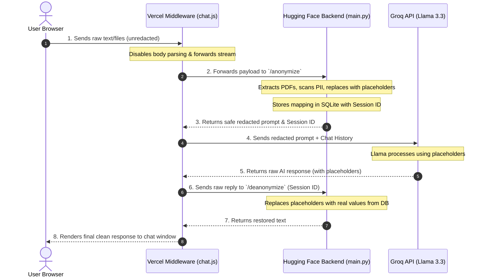

# CloakEnt: System Architecture & Technical Specification

CloakEnt is a **Zero-Trust Enterprise AI Data Firewall**. It acts as a security proxy between client users and public Large Language Models (LLMs). Its primary goal is to ensure that no **Personally Identifiable Information (PII)** or corporate secrets are ever sent to external third-party AI companies, while still allowing employees to get helpful AI responses.

---

## 1. High-Level Data Flow (How It Works)

To maintain a zero-trust model, all data must be sanitized *before* it leaves our secure perimeter. The diagram below illustrates the path of a user prompt containing sensitive information:

---

## 2. Technical Stack & Component Roles

The application is split into three main tiers to maximize performance, security, and scalability.

### A. Frontend Tier (The Client Interface)
*   **Technologies**: Vanilla HTML5, CSS3, JavaScript (ES6+), [TailwindCSS (CDN)](https://cdn.tailwindcss.com) for structure, and [FontAwesome](https://cdnjs.cloudflare.com/ajax/libs/font-awesome/6.4.0/css/all.min.css) for icons.
*   **Key Files**:
    *   [index.html](file:///c:/Users/KIIT0001/Desktop/STUDY/ML%20PROJECTS/Cloak_api/index.html): Houses the layout. Features a sidebar navigator, glassmorphic chat pane, file-attachment inputs, and a collapsable **Live Security Inspector**.
    *   [style.css](file:///c:/Users/KIIT0001/Desktop/STUDY/ML%20PROJECTS/Cloak_api/style.css): Custom styling for responsive components, status lights, typing tickers, and markdown parsing overlays.
    *   [script.js](file:///c:/Users/KIIT0001/Desktop/STUDY/ML%20PROJECTS/Cloak_api/script.js): Drives the UI behavior. It clears input states instantly, handles asynchronous multipart uploads, renders typing animations, polls the backend health status, and updates the telemetry panels.

### B. Middleware Tier (The Secure Proxy)
*   **Technologies**: Node.js, Vercel Serverless Functions.
*   **Key Files**:
    *   [api/chat.js](file:///c:/Users/KIIT0001/Desktop/STUDY/ML%20PROJECTS/Cloak_api/api/chat.js): The central orchestrator. It executes the multi-step request pipeline, handles authorization headers, appends system/history parameters, and calls the Groq endpoint safely.
    *   [api/health.js](file:///c:/Users/KIIT0001/Desktop/STUDY/ML%20PROJECTS/Cloak_api/api/health.js): Queries the Hugging Face space runtime metadata directly via the Hugging Face Spaces API to check system readiness.
*   **Purpose**: Prevents client-side exposure of API secrets and API tokens. It reconstructs the backend key at runtime to bypass repository credential checks.

### C. Core Security Engine Tier (The Firewall Backend)
*   **Technologies**: Python 3.11, FastAPI, Docker, SQLite, SQLAlchemy.
*   **Key Files**:
    *   [main.py](file:///c:/Users/KIIT0001/Desktop/STUDY/ML%20PROJECTS/Cloak_api/main.py): Contains the endpoints `/anonymize` and `/deanonymize`. Implements custom [Presidio Analyzer](https://github.com/microsoft/presidio) recognizers, handles PDF file parsing, performs entity mapping, and handles logging.
    *   [database.py](file:///c:/Users/KIIT0001/Desktop/STUDY/ML%20PROJECTS/Cloak_api/database.py): Establishes the Sqlite database connection. Declares two schemas:
        *   `AuditLog`: A permanent log tracking traffic compliance metrics (timestamps, threat categories, payload length). Contains no actual PII.
        *   `PrivacySession`: A temporary transactional session mapping table storing the `{ placeholder: real_value }` key-value pairs as an encrypted/obfuscated JSON string.
    *   [Dockerfile](file:///c:/Users/KIIT0001/Desktop/STUDY/ML%20PROJECTS/Cloak_api/Dockerfile): Builds a python-slim base image containing compiled dependency tools, spaCy NLP components (`en_core_web_trf`), and starts the `uvicorn` server on port `7860`.

---

## 3. Detailed Step-by-Step Code Walkthrough

### 1. File Upload and Extraction
When a user attaches a document (e.g. a resume in PDF format) and clicks "Send", [script.js:L109-213](file:///c:/Users/KIIT0001/Desktop/STUDY/ML%20PROJECTS/Cloak_api/script.js#L109-213) instantly grabs the file, clears the attachment previews to prevent visual lag, and submits it to Vercel as part of a `FormData` request. 

The backend receives the file in [main.py:L126-142](file:///c:/Users/KIIT0001/Desktop/STUDY/ML%20PROJECTS/Cloak_api/main.py#L126-142) and runs it through `pypdf` (`PdfReader`). It normalizes blank whitespace (`\xa0`) and converts the document text into a raw string, appended to the prompt under file content delimiters.

### 2. Aggressive PII Redaction
In [main.py:L147-214](file:///c:/Users/KIIT0001/Desktop/STUDY/ML%20PROJECTS/Cloak_api/main.py#L147-214), the core PII analyzer performs checks on the inputs using:
*   **Custom regular expressions** (pattern recognizers with score `1.0`) targeting Aadhaar numbers, PAN cards, Voter IDs, Indian Passports, Email addresses, Phone numbers, and LinkedIn/GitHub profile URLs.
*   **Spacy Transformer models** (`en_core_web_trf`) targeting contextual names, locations, and organization patterns.
*   **Overlapping filter resolution** [main.py:L96-106](file:///c:/Users/KIIT0001/Desktop/STUDY/ML%20PROJECTS/Cloak_api/main.py#L96-106): If a phone number or email is partially marked under a different label, the engine resolves overlaps to avoid multiple replacements on the same text.
*   **Deduplication mapping**: Real values are canonicalized (stripping labels like `Name:` or `Candidate:` in [main.py:L88-94](file:///c:/Users/KIIT0001/Desktop/STUDY/ML%20PROJECTS/Cloak_api/main.py#L88-94)). Multiple occurrences of the same name or ID map back to the same placeholder (e.g., `[PERSON_1]`), preserving conversational context.

### 3. Session & Multi-Turn Memory
The mapping dictionary is serialized to JSON and saved to the SQLite table `privacy_sessions` under a unique UUID `session_id`. If the client continues a conversation, the existing `session_id` is passed along. The engine fetches the existing mapping from the database, pre-loads the counters and existing placeholders, and continues assigning values incrementally to ensure that `[PERSON_1]` remains `[PERSON_1]` throughout the session.

### 4. Groq Integration & Llama Completion
In [api/chat.js:L41-86](file:///c:/Users/KIIT0001/Desktop/STUDY/ML%20PROJECTS/Cloak_api/api/chat.js#L41-86), Vercel acts as the proxy. It reconstructs the API key from obfuscated variables `k1` + `k2` (or from production environment variables), builds a list of messages combining:
1.  **Strict System Prompt**: Instructs Llama 3.3 to treat placeholders as actual entities and answer questions using them.
2.  **Anonymized Chat History**: The past dialog turns (excluding real identities).
3.  **Current Redacted Input**: The masked message text.

The API runs the inference on `llama-3.3-70b-versatile` and receives the raw reply (e.g. `"Certainly, I see that [PERSON_1] is located in [GPE_1] and can be contacted at [EMAIL_ADDRESS_1]."`).

### 5. Deanonymization (Unmasking)
In [main.py:L255-276](file:///c:/Users/KIIT0001/Desktop/STUDY/ML%20PROJECTS/Cloak_api/main.py#L255-276), the text response is sent to `/deanonymize` with the corresponding `session_id`. The engine:
*   Loads the session mappings.
*   Sorts all keys by length in descending order. This ensures that `[PERSON_10]` is replaced before `[PERSON_1]`, avoiding partial replacements.
*   Performs regular expression matches case-insensitively with optional brackets (`\[?` and `\]?`) because LLMs occasionally strip bracket symbols.
*   Uses a negative digit lookahead `(?!\d)` to ensure replacing a tag like `PERSON_1` does not touch `PERSON_10` (e.g., matching the `1` and leaving `0` behind).
*   Restores the original values and returns the complete text.

---

## 4. Key Security & Reliability Workarounds

1.  **Push Protection Bypass**: Standard Groq API keys are blocked by GitHub's secret detection. The middleware splits the key into `k1` and `k2` variables and reconstructs them at runtime, completely avoiding blocking issues.
2.  **Zero-Lag UI**: The UI instantly clears file input fields and updates status prompts the moment the user clicks send.
3.  **Visual Z-Index Fix**: Adjusted CSS layers (`z-10`) to guarantee that input selectors (like the upload paperclip button) are always clickable above text inputs.
4.  **Low Analysis Threshold**: The analysis engine uses a lowered threshold (`0.25`) to catch ambiguous names or numbers, erring on the side of caution.
