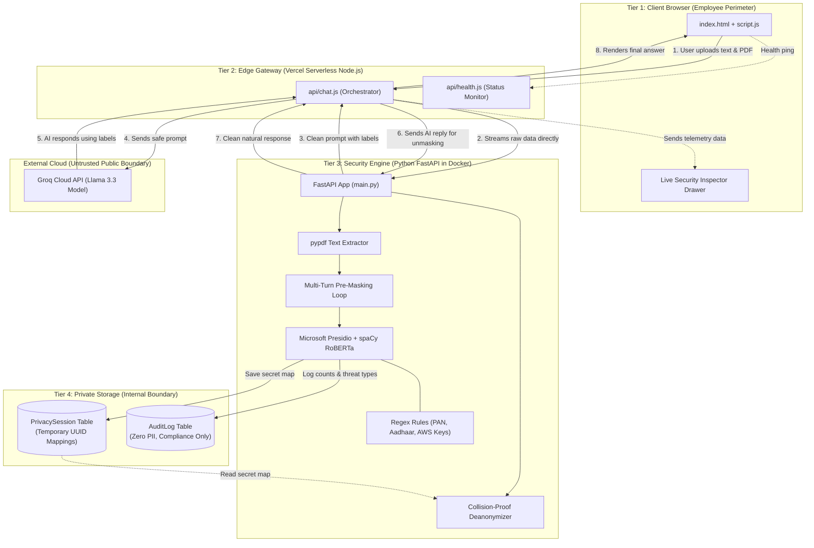
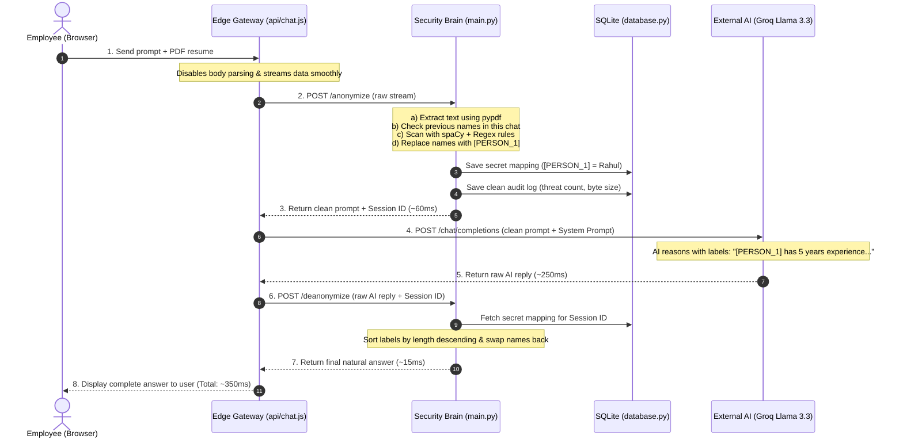

# 🛡️ CloakEnt: Complete Architecture & File Structure Guide
**A Simple, Practical Guide to Every File and Component in the Project**

> *"This guide explains the entire project layout, every single file, its exact contents, and how the components work together—written in plain, easy-to-understand language. Use this to prepare for system architecture and code walkthrough interview rounds."*

---

## 📌 Table of Contents

1. [📂 Complete Project File Structure](#1--complete-project-file-structure)
2. [📄 File-by-File Breakdown (Purpose, Contents & Key Logic)](#2--file-by-file-breakdown)
   - [A. Web Frontend (The User Interface)](#a-web-frontend-the-user-interface)
   - [B. Serverless Edge Gateway (Vercel Node.js)](#b-serverless-edge-gateway-vercel-nodejs)
   - [C. Core Security Engine (Python FastAPI Backend)](#c-core-security-engine-python-fastapi-backend)
   - [D. Deployment, Config & Database](#d-deployment-config--database)
   - [E. Documentation Files](#e-documentation-files)
3. [🏗️ Clean Architecture Diagrams for Interviews](#3-️-clean-architecture-diagrams-for-interviews)
   - [Diagram 1: Component & System Tier Diagram](#diagram-1-component--system-tier-diagram)
   - [Diagram 2: End-to-End Request Sequence Diagram](#diagram-2-end-to-end-request-sequence-diagram)
4. [🗣️ How to Walk an Interviewer Through This Architecture in 2 Minutes](#4-️-how-to-walk-an-interviewer-through-this-architecture-in-2-minutes)
5. [💡 Key Engineering Highlights You Should Mention](#5--key-engineering-highlights-you-should-mention)

---

## 1. 📂 Complete Project File Structure

Here is the complete project tree. Each file has a focused, single responsibility:

```text
Cloak_api/
│
├── api/                               # 🌐 Serverless API Gateway (Vercel Node.js)
│   ├── chat.js                        # Main pipeline controller: streams data & calls AI
│   └── health.js                      # Health check: checks if backend is online
│
├── index.html                         # 🖥️ Web App UI: Chat screen & Security Inspector
├── style.css                          # 🎨 Custom styling: dark theme, animations, layout
├── script.js                          # ⚡ Client logic: handles uploads, events & rendering
├── logo.png                           # 🛡️ Project logo and browser tab favicon
│
├── main.py                            # 🧠 Python Security Engine: hides and restores PII
├── database.py                        # 🗄️ Database models: temporary sessions & clean audit log
├── audit_logs.db                      # 💾 SQLite database file created automatically at runtime
│
├── Dockerfile                         # 🐳 Container instructions for Python backend
├── requirements.txt                   # 📦 Python libraries and machine learning model links
├── .env                               # 🔑 Environment keys (API keys, backend URL)
│
├── .gitignore                         # 🚫 Files Git should ignore (virtual environments, keys)
├── .gitattributes                     # ⚙️ Line ending and Git configuration settings
│
├── architecture_guide.md              # 📘 This architecture & file explanation guide
├── PROJECT_EXPLANATION.md             # 🗣️ Spoken interview speeches, analogies & top 10 Q&As
└── README.md                          # 🚀 Project overview, setup steps & feature highlights
```

---

## 2. 📄 File-by-File Breakdown

Here is what every file does, what code is inside it, and what to say if an interviewer asks about it.

---

### A. Web Frontend (The User Interface)

#### 1. [index.html](file:///c:/Users/KIIT0001/Desktop/STUDY/ML%20PROJECTS/Cloak_api/index.html)
* **What it is:** The single-page web interface for the entire application.
* **What’s inside:**
  * **Navigation Sidebar:** Allows switching between the **Secure Chat** screen and the **Audit Logs** table.
  * **Backend Status Widget:** Displays real-time status (`Connecting...`, `Online`, or `Offline`).
  * **Latency Bar:** Shows live timing numbers (Sanitization time, AI response time, Unmasking time, and Total overhead %).
  * **Chat Area:** Contains message bubbles, a prompt suggestion bar, and a file attachment button (paperclip).
  * **Live Security Inspector (Collapsible Drawer):** An enterprise inspection pane on the right side showing:
    1. *Raw Intercepted Prompt* (before masking).
    2. *Anonymized Prompt* (with color-coded badge tags like `[PERSON_1]`).
    3. *Raw AI Response* (the unmodified answer received from Groq).
* **Interview Explanation:**  
  > *"I designed `index.html` as a glassmorphic enterprise dashboard. It not only lets employees chat with AI safely, but it also gives security teams a live side-by-side view showing exactly what was redacted before leaving the company perimeter."*

#### 2. [style.css](file:///c:/Users/KIIT0001/Desktop/STUDY/ML%20PROJECTS/Cloak_api/style.css)
* **What it is:** The custom stylesheet that enhances TailwindCSS.
* **What’s inside:**
  * Custom dark mode colors (`slate-900`, `slate-950`, `emerald-500` accents).
  * Subtle glowing status lights (animated green pulse for online, amber for connecting).
  * Custom scrollbars, glassmorphic backdrop blurs, and slide-in drawer transitions.
  * Z-index fixes ensuring file upload controls are always easily clickable above text areas.
* **Interview Explanation:**  
  > *"While TailwindCSS handles the overall layout structure, `style.css` provides custom micro-animations, status-dot pulses, and z-index layering so the app feels polished and enterprise-ready."*

#### 3. [script.js](file:///c:/Users/KIIT0001/Desktop/STUDY/ML%20PROJECTS/Cloak_api/script.js)
* **What it is:** The client-side JavaScript that brings the interface to life.
* **What’s inside:**
  * **File Handling:** Grabs attached PDF files, shows instant previews, and clears inputs on send so the UI feels instant.
  * **Streaming Communication:** Submits user prompts and attached documents via `FormData` to `/api/chat`.
  * **Chat History Tracking:** Maintains safe, anonymized multi-turn chat history on the client side.
  * **Session Persistence:** Remembers the active `session_id` returned by the server so follow-up questions stay in the same conversation.
  * **Inspector Renderer:** Formats sensitive placeholder tags with glowing color-coded badges in the live inspector pane.
  * **Health Polling:** Periodically checks `/api/health` and updates the status indicator.
* **Interview Explanation:**  
  > *"`script.js` handles client state, multi-turn chat history, and background health polling. It ensures files upload smoothly without UI lag and dynamically renders security telemetry in real time."*

#### 4. [logo.png](file:///c:/Users/KIIT0001/Desktop/STUDY/ML%20PROJECTS/Cloak_api/logo.png)
* **What it is:** The project branding asset.
* **What’s inside:** The shield logo icon used on the web page header and as the browser tab favicon.

---

### B. Serverless Edge Gateway (Vercel Node.js)

#### 5. [api/chat.js](file:///c:/Users/KIIT0001/Desktop/STUDY/ML%20PROJECTS/Cloak_api/api/chat.js)
* **What it is:** The central traffic coordinator running as a serverless Node.js function on Vercel.
* **What’s inside:**
  * **Zero-Copy Streaming (`duplex: 'half'`):** With `bodyParser: false`, it pipes the user's incoming file upload stream directly to the Python backend without loading multi-megabyte files into Node memory.
  * **Step 1 (Call Anonymize):** Sends raw data to Python (`/anonymize`), receiving back clean text and a `session_id`.
  * **Step 2 (Call Groq AI):** Constructs the payload with an enterprise system prompt instructing the AI model (`Llama 3.3` / `openai/gpt-oss-120b`) to answer using the placeholder tags.
  * **Step 3 (Call Deanonymize):** Takes the raw AI response and sends it to Python (`/deanonymize`) with the `session_id` to swap real names back in.
  * **Telemetry Measurement:** Records exact millisecond timings for sanitization, AI inference, and unmasking, returning them to the frontend.
* **Interview Explanation:**  
  > *"`api/chat.js` is our API gateway. It shields our private API keys, streams file uploads directly without memory hogging, and coordinates the 3-step security pipeline between Python and external AI."*

#### 6. [api/health.js](file:///c:/Users/KIIT0001/Desktop/STUDY/ML%20PROJECTS/Cloak_api/api/health.js)
* **What it is:** The lightweight system health check endpoint.
* **What’s inside:**
  * Connects to the Hugging Face Spaces API to check if the Python container is `RUNNING` or asleep.
  * Returns a simple HTTP `200` (Online) or `503` (Offline) so the frontend status widget can update automatically.
* **Interview Explanation:**  
  > *"`api/health.js` provides instant runtime visibility into our container backend so users know whether the AI engine is warm and ready before typing a message."*

---

### C. Core Security Engine (Python FastAPI Backend)

#### 7. [main.py](file:///c:/Users/KIIT0001/Desktop/STUDY/ML%20PROJECTS/Cloak_api/main.py)
* **What it is:** The heart of the security system—the Python FastAPI service that sanitizes and unmasks data.
* **What’s inside:**
  * **FastAPI Web Service:** Provides `/` (health), `/anonymize`, and `/deanonymize` endpoints.
  * **PDF Extraction (`pypdf`):** Reads binary PDF uploads page-by-page and normalizes whitespace characters.
  * **Contextual Language Scanning:** Loads spaCy's transformer model (`en_core_web_trf`) inside Microsoft Presidio to detect names, locations, and companies based on grammatical context.
  * **Exact Pattern Recognizers:** High-confidence regex rules (`score = 1.0`) for:
    * Indian Identity: PAN Cards, Aadhaar Cards, Passports, Voter IDs.
    * Personal Contact: Emails, Phone numbers, Profile URLs.
    * Developer Secrets: AWS Access Keys (`AKIA...`), GitHub Personal Access Tokens (`ghp_...`), Google API Keys, and JWT tokens.
  * **Pre-Masking Loop:** For existing sessions, scans incoming prompts for names spotted in previous turns *before* running new scans, keeping entity labels consistent across long chats.
  * **Overlap Resolver:** If a word is flagged by multiple rules, picks the best match and removes duplicate tags.
  * **Safe Unmasking:** Sorts placeholder keys by length from longest to shortest and uses regex `r'\[?' + tag + r'\]?(?!\d)'` to prevent number mix-ups (like `[PERSON_1]` corrupting `[PERSON_10]`).
* **Interview Explanation:**  
  > *"`main.py` is our security brain. It combines transformer models with strict regex rules to catch both contextual names and secret keys. It also solves two tough edge cases: multi-turn name consistency and number mix-ups during unmasking."*

#### 8. [database.py](file:///c:/Users/KIIT0001/Desktop/STUDY/ML%20PROJECTS/Cloak_api/database.py)
* **What it is:** The database configuration and table definitions using SQLAlchemy.
* **What’s inside:**
  * **Database Connection:** Connects to a local SQLite database (`audit_logs.db`).
  * **Table 1: `PrivacySession` (Temporary):**
    * Stores `{ session_id, entity_mapping, created_at }`.
    * Holds the secret dictionary (e.g., `{"[PERSON_1]": "Rahul Sharma"}`) so the engine knows how to swap names back.
  * **Table 2: `AuditLog` (Permanent & Compliance-Safe):**
    * Stores `{ id, timestamp, original_prompt_length, threats_detected, threat_types }`.
    * **Zero PII Rule:** Records *how many* items were found and *what types*, but **never stores a single byte of real personal data**.
* **Interview Explanation:**  
  > *"`database.py` enforces our privacy guarantee. We keep temporary name mappings in a session table, while the permanent audit log stores only threat counts and categories—fully complying with GDPR data minimization."*

---

### D. Deployment, Config & Database

#### 9. [Dockerfile](file:///c:/Users/KIIT0001/Desktop/STUDY/ML%20PROJECTS/Cloak_api/Dockerfile)
* **What it is:** The blueprint used to build the production Linux container for the Python backend.
* **What’s inside:**
  * Starts from a minimal `python:3.11-slim` image.
  * Installs C++ build dependencies (`build-essential`) needed to compile native NLP libraries.
  * Installs all packages and downloads the spaCy RoBERTa model from [requirements.txt](file:///c:/Users/KIIT0001/Desktop/STUDY/ML%20PROJECTS/Cloak_api/requirements.txt).
  * Exposes port `7860` (the standard port used by Hugging Face Spaces) and starts the server using `uvicorn`.
* **Interview Explanation:**  
  > *"`Dockerfile` packages our Python backend into a portable container with all C++ and NLP machine-learning dependencies pre-compiled, ensuring identical behavior across local and cloud environments."*

#### 10. [requirements.txt](file:///c:/Users/KIIT0001/Desktop/STUDY/ML%20PROJECTS/Cloak_api/requirements.txt)
* **What it is:** The list of Python libraries required to run the security engine.
* **What’s inside:**
  * `fastapi` & `uvicorn`: High-speed asynchronous web framework and server.
  * `python-multipart` & `pypdf`: Multipart file parsing and PDF text extraction.
  * `SQLAlchemy`: Database ORM for managing sessions and audit logs.
  * `presidio_analyzer` & `presidio_anonymizer`: Microsoft's data protection framework.
  * `spacy` + `en_core_web_trf` (direct wheel link): RoBERTa transformer language model for contextual entity detection.

#### 11. [.env](file:///c:/Users/KIIT0001/Desktop/STUDY/ML%20PROJECTS/Cloak_api/.env)
* **What it is:** The local configuration file for secret credentials.
* **What’s inside:** Contains environment variables like the Groq AI API key (`GROQ_API_KEY`) and backend URLs, keeping secrets out of public code.

#### 12. [audit_logs.db](file:///c:/Users/KIIT0001/Desktop/STUDY/ML%20PROJECTS/Cloak_api/audit_logs.db)
* **What it is:** The local SQLite database file generated automatically when `init_db()` runs. Stores temporary sessions and permanent compliance records.

#### 13. [.gitignore](file:///c:/Users/KIIT0001/Desktop/STUDY/ML%20PROJECTS/Cloak_api/.gitignore) & [.gitattributes](file:///c:/Users/KIIT0001/Desktop/STUDY/ML%20PROJECTS/Cloak_api/.gitattributes)
* **What they are:** Git configuration files.
  * `.gitignore` prevents uploading virtual environments (`cloak_env/`), cached files (`__pycache__/`), and private credentials (`.env`).
  * `.gitattributes` ensures consistent line endings (`LF` vs `CRLF`) across Windows, Mac, and Linux.

---

### E. Documentation Files

#### 14. [architecture_guide.md](file:///c:/Users/KIIT0001/Desktop/STUDY/ML%20PROJECTS/Cloak_api/architecture_guide.md) (This File)
* **What it is:** The complete guide to every file, folder, and architectural component in the project.

#### 15. [PROJECT_EXPLANATION.md](file:///c:/Users/KIIT0001/Desktop/STUDY/ML%20PROJECTS/Cloak_api/PROJECT_EXPLANATION.md)
* **What it is:** The ultimate interview preparation guide. Contains word-for-word spoken pitches (60-sec, 3-min, 5-min), real-world analogies, top 10 interview questions and answers, and key numbers.

#### 16. [README.md](file:///c:/Users/KIIT0001/Desktop/STUDY/ML%20PROJECTS/Cloak_api/README.md)
* **What it is:** The GitHub project landing page with setup steps, feature summaries, and quickstart commands.

---

## 3. 🏗️ Clean Architecture Diagrams for Interviews

### Diagram 1: Component & System Tier Diagram
This diagram shows how the 4 physical tiers connect and what each tier is responsible for:



---

### Diagram 2: End-to-End Request Sequence Diagram
This diagram shows the exact chronological order of a request, including typical speeds:



---

## 4. 🗣️ How to Walk an Interviewer Through This Architecture in 2 Minutes

When the interviewer asks: *"Can you explain the overall system architecture?"*, deliver this structured 5-part walkthrough:

> 1. **The Big Picture:**  
>    *"CloakEnt is split into two primary layers: a lightweight **Edge Gateway** on Vercel Node.js and a dedicated **Security Engine** on Python FastAPI in Docker."*
>
> 2. **Step 1 — Receiving and Streaming:**  
>    *"When a user submits a prompt or a PDF document, it hits our Node.js gateway at `api/chat.js`. We turn off default body parsing so that file uploads are streamed directly to Python using `duplex: 'half'`, avoiding serverless memory limits."*
>
> 3. **Step 2 — The Python Security Brain:**  
>    *"Inside `main.py`, we extract text with `pypdf` and check for any names known from earlier messages in this chat. Then, Microsoft Presidio and a spaCy RoBERTa model scan for names and places, while custom regex rules catch Indian IDs like PAN cards and developer secrets like AWS keys. All sensitive items are replaced with labels like `[PERSON_1]`, and the secret mapping is stored in SQLite under a session ID."*
>
> 4. **Step 3 — Safe External AI Call:**  
>    *"The clean prompt flows back to Vercel, which sends it to Groq Cloud running Llama 3.3. Groq generates an answer using the placeholder labels in around 250 milliseconds."*
>
> 5. **Step 4 — Clean Unmasking & Return:**  
>    *"Vercel sends the AI reply back to Python's `/deanonymize` endpoint. Python loads the session map, swaps the real names back in safely, writes a zero-PII record to `AuditLog`, and returns the final answer to the user. The whole roundtrip takes only ~350 milliseconds."*

---

## 5. 💡 Key Engineering Highlights You Should Mention

Mention these 4 key design choices to show strong technical depth:

1. **Why Separate Node.js and Python?**  
   Python is CPU-heavy (running NLP transformer models). Node.js is I/O-friendly (handling outside internet connections). Separating them means Python never sits idle waiting on external AI network delays.
2. **Zero-Copy File Streaming:**  
   Instead of buffering large 10MB PDF files in Node.js serverless RAM, we stream chunks straight through to Python using chunked transfer encoding.
3. **Multi-Turn Session Memory (Pre-Masking):**  
   In a multi-turn chat, we pre-scan incoming messages using names discovered in earlier turns. That guarantees 'Rahul' is always `[PERSON_1]` throughout the conversation.
4. **Zero-PII Compliance Storage:**  
   The audit log permanently tracks timestamps, byte sizes, and threat categories for company compliance, but **never stores a single byte of real personal data**.
